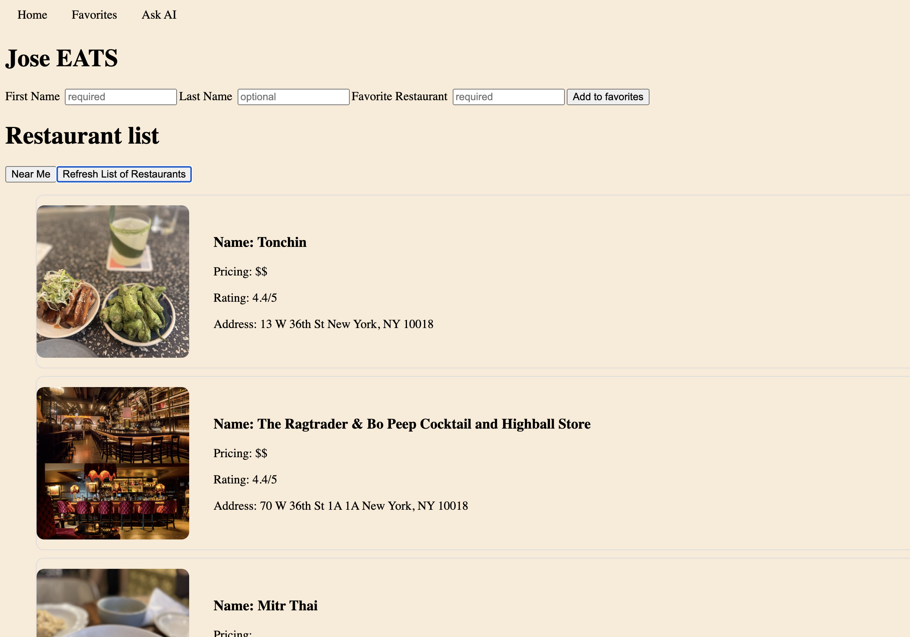

# Restaurant Finder

## Description
I built this project with interests in solving the issue of finding a good restaurant to eat when out and about in NYC. Since there is always a new trending restaurant on tiktok, this application would set out to implement the option to allow the user to favorite restaurants and they can then access a forum where users will be able to discuss restaurants they have been to and why they recommend. 
- Building this project I learned a lot on React structure using useState, useEffect. Managed to pull real data from the Yelp Api and Geolocation Api to provide the users with some real data from local restaurants. Learned how to connect to MongoDB and use mongoose to retrieve data from the database and create new data.

  
## Table of Contents 
- [Installation](#installation)
- [Usage](#usage)
- [Credits](#credits)
- [License](#license)

## Installation

npm install 

## Usage

 

## Credits

APIs used:
- https://fusion.yelp.com/fusion-ai/
- https://developer.mozilla.org/en-US/docs/Web/API/Geolocation_API

## License

---

## Badges

## Features

## How to Contribute

## Tests
